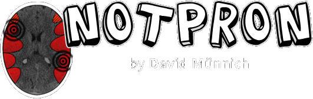

# [`notpron`](https://notpron.com/notpron/) aka the hardest riddle of the internet

> [!WARNING]
> **Spoilers ahead!** If you're planning on solving the riddle yourself I advise you to be careful.
 

  
### ABOUT

**Notpron** is an online puzzle game and internet riddle created in 2004 by German game developer David Münnich.  
It has been named as "the hardest riddle available on the internet".  
 
As of October 2020, **only 100 people** have completed the game, **out of 20 million visitors** since August 2004.[^src1]

<!-- Progressbar -->

### PROGRESS

 
 
View my level progesssheet [here](https://docs.google.com/spreadsheets/d/17xqEx-dCnFAxLlibAF48caXfEq-X7fRX_ucbvxFb8D0/edit?usp=sharing)

 

<!-- Sources -->
[^src1]: https://en.wikipedia.org/wiki/Notpron#History
